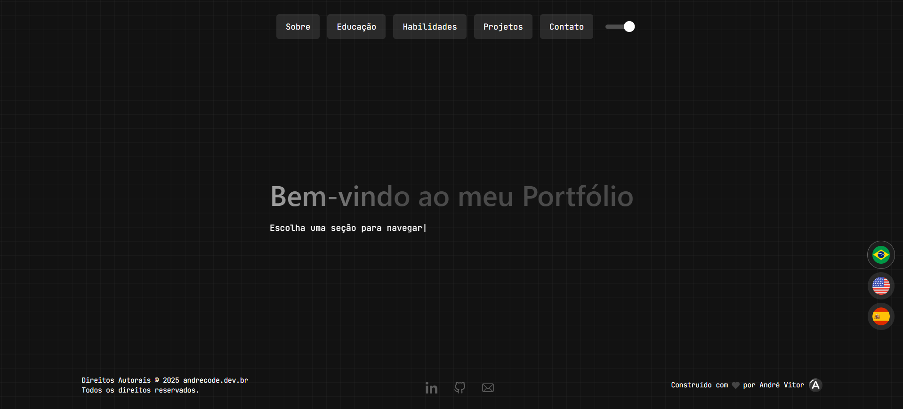

# 📘 Portfólio – André Vitor | AndreCodeDev

**Tema:** Portfólio Pessoal  
**Objetivo:** Apresentar meus projetos, habilidades e experiências como desenvolvedor Front-End.  
**Tecnologias Utilizadas:** React, TypeScript, Vite, CSS/SCSS.  

## 🧑‍💻 Descrição da Atividade

Este projeto é o meu portfólio pessoal, desenvolvido com foco em performance, escalabilidade e boas práticas de desenvolvimento.
Ele serve como um espaço para reunir meus trabalhos, informações de contato e um pouco sobre minha trajetória na programação.

A proposta é ter um portfólio moderno, responsivo e de fácil navegação, destacando meus principais projetos e competências técnicas.

---

## 📝 Funcionalidades

- ✅ **Página Inicial:** Apresentação pessoal e chamada para ação.  
- ✅ **Seção de Projetos:** Exposição de projetos com descrição e links para repositórios/demonstrações.  
- ✅ **Seção Sobre:** Resumo da minha trajetória e habilidades técnicas.  
- ✅ **Formulário de Contato:** Integração com serviços externos (e-mail/WhatsApp).  
- ✅ **Responsividade:** Layout adaptado para dispositivos móveis, tablets e desktops.  
- ✅ **Internacionalização (i18n):** Suporte a múltiplos idiomas.  

---

## 📂 Estrutura de Pastas 
```
novo-portfolio/
├── dist/                   # Build gerado (não versionar)
├── node_modules/           # Dependências do projeto
├── public/                 # Arquivos estáticos públicos
│   ├── cv/                 # Currículo / PDFs
│   └── locales/            # Arquivos de tradução
├── src/                    # Código-fonte principal
│   ├── components/         # Componentes reutilizáveis
│   ├── data/               # Dados estáticos (TS/JSON)
│   ├── img/                # Imagens do projeto
│   ├── pages/              # Páginas principais
│   ├── styles/             # Estilos globais
│   ├── App.tsx             # Componente raiz
│   ├── i18n.ts             # Configuração de tradução
│   ├── index.css           # Estilos globais principais
│   ├── main.tsx            # Ponto de entrada do app
│   └── vite-env.d.ts       # Tipagens do Vite
├── .gitignore              # Ignora arquivos/pastas no Git
├── eslint.config.js        # Configuração do ESLint
├── index.html              # HTML principal
├── package.json            # Dependências e scripts
├── package-lock.json       # Lockfile do npm
├── tsconfig.json           # Configuração principal do TypeScript
├── tsconfig.app.json       # TS config para app
├── tsconfig.node.json      # TS config para Node
└── vite.config.ts          # Configuração do Vite
```
---

## 💡 O que foi aprendido  

Durante o desenvolvimento deste portfólio, pude reforçar conceitos importantes como:  

- Organização de projeto com **React + TypeScript**.  
- Uso do **Vite** para build rápido e otimizado.  
- Estruturação de **componentes reutilizáveis**.  
- Configuração de **internacionalização (i18n)**.  
- Aplicação de **CSS modularizado** para escalabilidade.  
- Deploy em plataforma moderna (Vercel).  

---

## ✅ Tecnologias Utilizadas  

- **React** ⚛️  
- **TypeScript** 📘  
- **Vite** ⚡  
- **CSS3 / SCSS** 🎨  
- **i18next** 🌍  
- **Node.js** 🟢  

---

## 📸 Prévia do Projeto  

> *Link da Hospedagem: [andrecode.dev](https://andrecode.dev.br/)


---

## 📎 Autor  

Desenvolvido por **André Vitor - ANDRECODEDEV** 👨‍💻  
📩 [LinkedIn]([https://linkedin.com/in/andrecode](https://www.linkedin.com/in/andrecodedev/)) | [GitHub](https://github.com/andrecode)  
